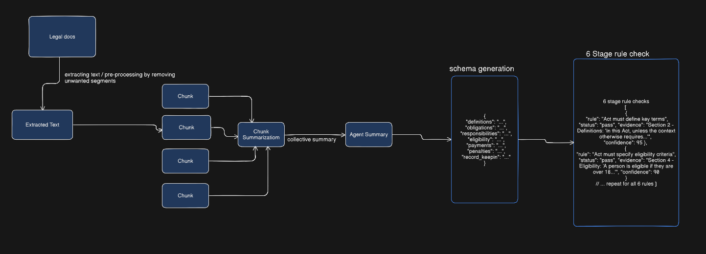

# Legislative AI Agent

A Python application that processes legislation PDFs using Google Gemini API to extract structured insights and generate compliance reports.

## Workflow



## Project Structure

```
/project_root
│
├── agent.py              # Main LegislativeAgent class (orchestrator)
├── app.py                # Streamlit UI application
├── debug_agent.py        # Debug script for the agent
├── requirements.txt      # Python dependencies
├── README.md             # This file
├── workflow.png          # Workflow diagram
├── chunk_summaries.json  # Intermediate chunk summaries
├── legislation_analysis.json  # Final output
└── src/                  # Source modules
    ├── __init__.py
    ├── text_utils.py         # Text extraction, cleaning, and chunking utilities
    ├── summarizer.py         # Text summarization functionality
    ├── section_extractor.py  # Section extraction from legislation
    ├── rule_checker.py       # Legal document rule compliance checking
    └── json_exporter.py      # JSON export functionality
```

## Detailed Workflow

1. **PDF Ingestion**:
   - User uploads a legislation PDF through the Streamlit UI
   - The agent extracts raw text from the PDF using PyMuPDF

2. **Text Preprocessing**:
   - Clean the extracted text (remove page numbers, artifacts, normalize whitespace)
   - Remove isolated numbers and non-ASCII characters

3. **Text Chunking**:
   - Split the cleaned text into manageable chunks (default size: 6000 characters)
   - This allows for efficient processing of large documents

4. **Parallel Processing**:
   - **Chunk Summarization**: Each chunk is summarized independently using Gemini
   - **Section Extraction**: Key sections are extracted from the full text
   - **Rule Compliance Check**: The text is checked against legal document rules

5. **Summary Combination**:
   - Individual chunk summaries are combined into a comprehensive final summary
   - The final summary covers key aspects: Purpose, Definitions, Eligibility, Obligations, Enforcement

6. **Results Compilation**:
   - All results are compiled into a structured JSON output
   - Includes final summary, extracted sections, and rule compliance results

## How to Run

1. **Install Dependencies**:
   ```bash
   pip install -r requirements.txt
   ```
   or if using python3:
   ```bash
   pip3 install -r requirements.txt
   ```

2. **Set Google API Key**:
   Create a `.env` file in the project root with your Google Gemini API key:
   ```
   GOOGLE_API_KEY=your_api_key_here
   ```
   
   Alternatively, you can enter the API key in the Streamlit UI.

3. **Run the Streamlit App**:
   ```bash
   streamlit run app.py
   ```

## Features

- **Modular Design**: Each component is separated into its own module for maintainability
- **PDF Upload**: Upload any legislation PDF for analysis
- **Text Extraction**: Extract and clean text from PDFs with advanced cleaning
- **AI Processing**: Process legislation with Google Gemini 2.5 Flash model
- **Executive Summary**: Bullet-point summary of key provisions
- **Section Extraction**: Isolated views of definitions, obligations, etc.
- **Legal Document Compliance Checking**: Rule validation against 6 specific legal document rules
- **Chunk Storage**: Individual chunk summaries are stored for audit purposes
- **JSON Export**: Download structured analysis reports
- **Optimized Processing**: Reuses existing chunk summaries if available

## Requirements

- Python 3.7+
- Google Gemini API key
- Dependencies listed in requirements.txt

## No External Libraries

This implementation avoids external libraries like:
- LangChain
- RAG systems
- Embedding models

All processing is done directly with the Google Generative AI SDK.

## Advanced Text Cleaning

The agent now includes advanced text cleaning features:
- Removal of page numbers and artifacts
- Normalization of whitespace
- Elimination of isolated numbers
- Removal of non-ASCII characters
- Consolidation of multiple blank lines

## Chunk Processing

Each text chunk is processed individually and stored:
- Chunk summaries are saved for audit purposes
- Individual processing allows for better handling of large documents
- Results can be reviewed at each step of the pipeline
- Existing chunk summaries are reused to save processing time

## Legal Document Rule Compliance

The agent checks legislation against 6 specific legal document rules:
1. **Key Terms Definition**: Verifies if the act defines key terms
2. **Eligibility Criteria**: Checks if the act specifies who is eligible
3. **Authority Responsibilities**: Determines if the act specifies what the government must do
4. **Enforcement Methods**: Verifies if the act lists penalties or enforcement methods
5. **Payment Calculations**: Checks if the act explains how to calculate payments
6. **Record-keeping Requirements**: Determines if the act requires records or reporting

For each rule, the agent determines:
- Pass/fail status
- Evidence from the text
- Confidence score (0-100)

## Model Configuration

The agent uses the Google Gemini 2.5 Flash model with a temperature of 0.3 for more stable responses.